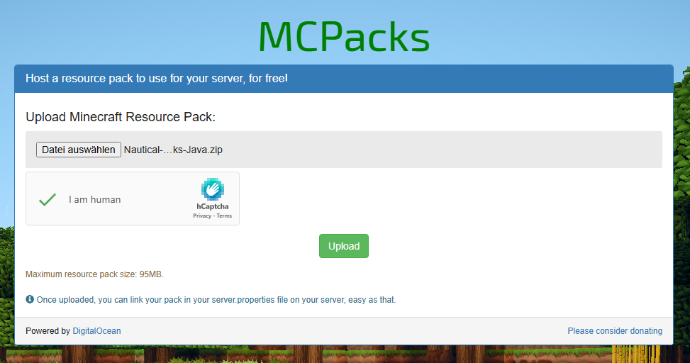

# How to use custom textures

In this tutorial, I will explain step by step how you can use custom rank textures for your ranks to make them look more beautiful.

## 🗂️ Requirements

1. A texture pack with custom rank textures (I'll use [Nautical-Ranks](https://github.com/DeathEnderMan/Nautical-Ranks) in this tutorial)
2. A server with SlimeRanks installed

## 🛫 Let's get started



### Setting up the texture pack

At first we have to make sure that the server can use the texture pack. So we have to download it and upload it to [MCPacks](https://mc-packs.net/).

<figure><figcaption></figcaption></figure>

After doing that, you can click on "Upload" to actually load up the texture pack to MCPacks and receive the information we need.

The page should look something like the following:

<figure><figcaption></figcaption></figure>

Keep this site open for now; we'll need the information on the page for step 2.



### Setting up the server texture pack

Now we have to require players to use the texture pack. We're doing that by adding the texture pack directly to the server that players are asked to download and use the texture pack on join.

To do that, you need to open the server.properties of your server.

In there you have to search for the `resource-pack`key and insert the download URL of the texture pack. You can find the download URL on the MCPacks site, which you still have open.

The same we're doing for the `resource-pack-sha1`key. There we're putting the SHA-1 hash value of the MCPacks site.

Now optional but still recommended is to change the value from the `require-resource-pack` key from `false`to `true` so players can only join when accepting the texture pack.

Also recommended is to fill the `resource-pack-id` key with a random UUID. You simply can generate a UUID on [uuidgenerator.net](https://www.uuidgenerator.net/).

Last but not least, if you want players to see a message before accepting the texture pack, you can fill the `resource-pack-prompt`key. The value you insert there has to be a JSON string, so I recommend using a [JSON Text Generator](https://minecraft.tools/en/json_text.php).


To activate these changes you need to restart your server.




### Setting up ranks with custom textures

You can now create new ranks with the custom texture from the texture pack or add custom textures to existing ranks.

If you enjoy working with a GUI in the game, check out the following article on how to create or edit ranks via the GUI.

[configure-slimeranks-gui.md](../slimeranks/configure-slimeranks-gui.md "mention")

If you prefer working with config files, I recommend reading the following article.

[ranks.yml.md](../slimeranks/configure-slimeranks-config/ranks.yml.md "mention")

First, you can create ranks normally, just like it's explained in the guides.\
But as soon as it comes to setting a format, we have to do things a little differently.

To understand how custom rank textures work:\
In the texture pack you added, a specific character was assigned a new texture that shows the rank.\
So basically, instead of using a rank prefix, you just use the character that got the new texture.

To show the rank using a texture, look for the character that's linked to the texture you want.\
In this example, the characters for each texture are listed in the [README of the GitHub repository](https://github.com/DeathEnderMan/Nautical-Ranks?tab=readme-ov-file#available-ranks).

Once you've found the right character, you just adjust the rank format like shown in the guides above; it should look something like this.

```
 <dark_gray>|</dark_gray> <gray>{player}</gray>
```

In this case,  is the character with the texture.



## 🎯 That's it

You have now successfully added a custom texture to your ranks. You can assign these ranks to players as usual, and they will be displayed with the rank.

<figure><figcaption></figcaption></figure>
